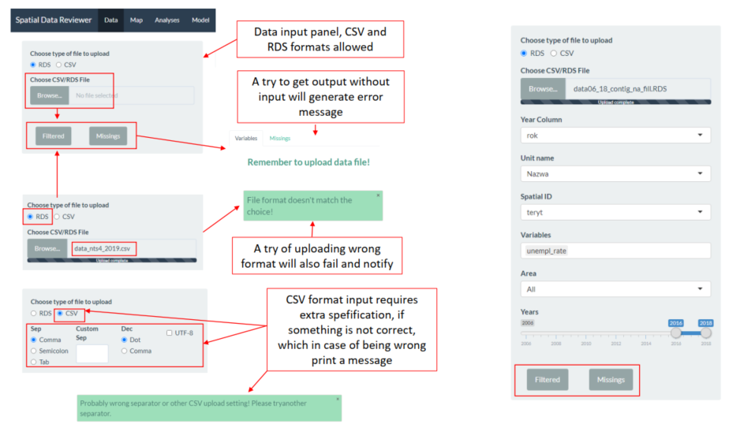
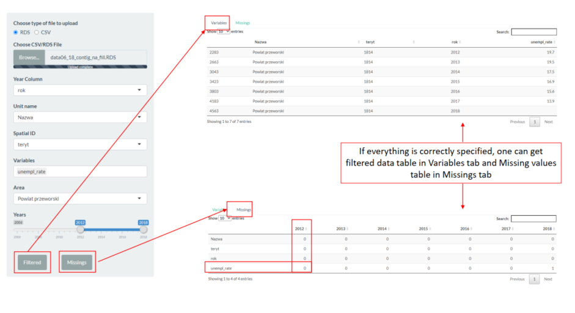
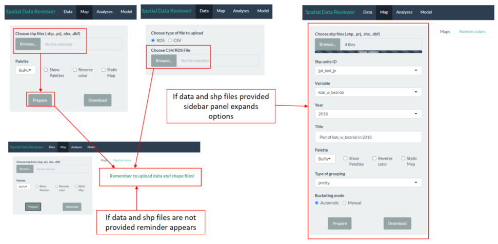
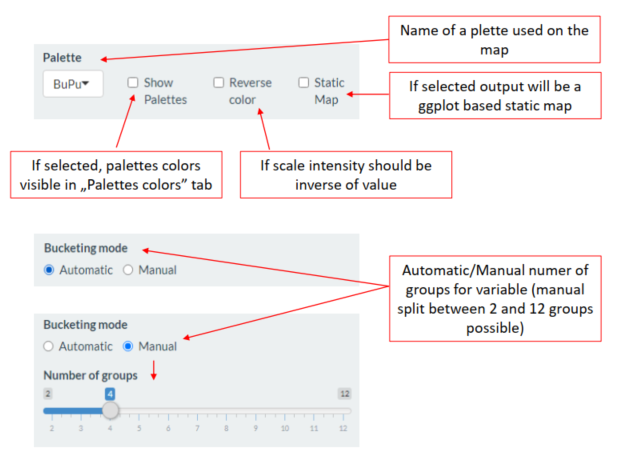
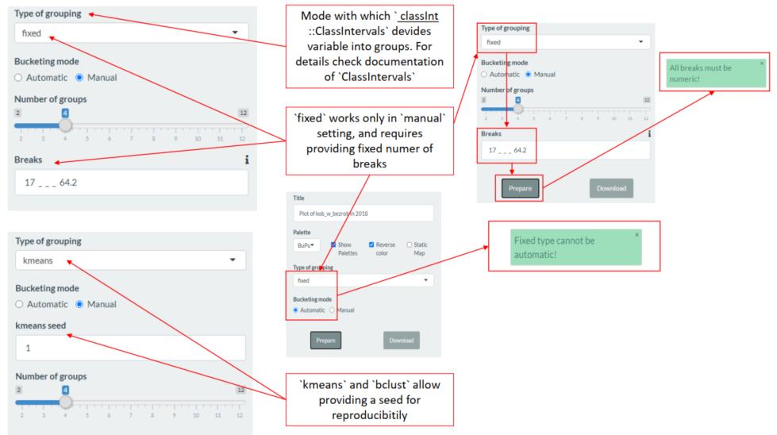
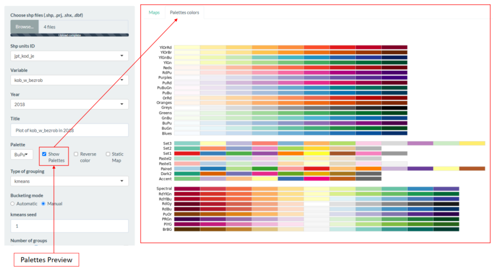
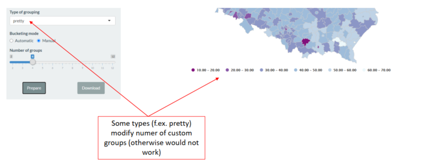
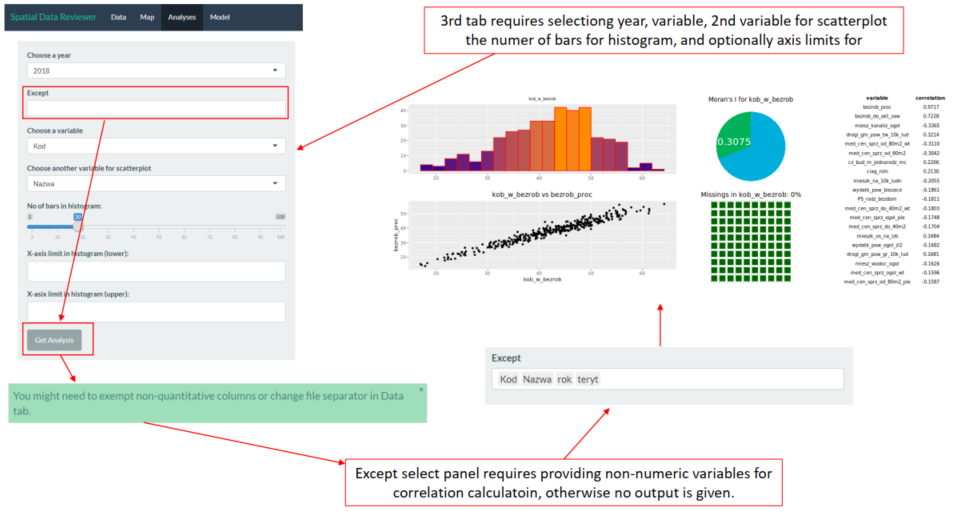
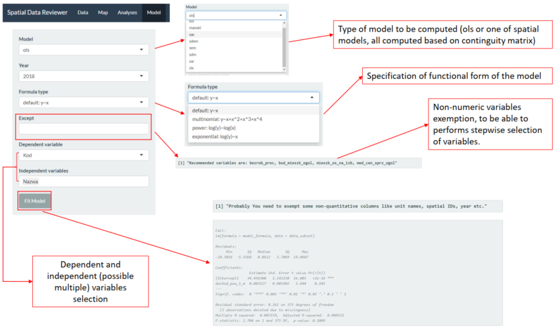

# Spatial Data Analyzer  

### Hubert Śmieciuch

### Maciej Świtała

### 2020  

------

###### Repository: https://github.com/superHubert/spatial_data_reviewer

###### Shiny server app: http://ec2-34-207-189-82.compute-1.amazonaws.com:3838/pov_spatial_model/app/

------

### An app is a tool for quick and hand spatial data overview.

Four tabs of the Spatial Data Reviewer:

1. Data
2. Map
3. Analyses
4. Model  

------

### Tab one - `Data`.

Here user provides a `data file` in one of two formats  **.csv**  or **.rds** . It has two main functions:

1. Getting familiar with data with filtering by year, unit and variable
2. Checking for missing values per year and variable for given unit(s), which can be
   helpful in choosing a right variable and year for further analysis

For review one can load `data06_18_contig_na_fill.RDS` file in data directory. **Spatial ID** should be selected as: **teryt**  https://github.com/superHubert/spatial_data_reviewer/blob/master/data/data06_18_contig_na_fill.RDS

------

### Tab two - `Map`

Here user may provide `spatial data files` (required/allowed files are: **.shp, .prj, .shx, .dbf**). 

`Map` tab provided `shapefile`  spatial units are matched by **Shp units ID** input, with `Data` tab provided file elements assigned by selected **Spatial ID**. It is important to select appropriate variables, otherwise map will not be created.

For review one can load `powiaty4` shapefiles in data directory. **Shp units ID** will be by defould sellected appropriately.

Main features are:

1. Preparing interactive map (based on `highcharter` package), which can be
   downloaded in **.hmtl** format

2. Preparing static map based on `ggplot` package, which can be downloaded
   in **.png** format.

3. Maps can be customized in form of **palette color**,  various **variable bucketing methods**, **custom title**, **sizes of legend in static map**, reversed colors of scale.

4. One can prepare map **automatically** with **default settings** after providing data files and selecting year and variable (automatic split in pretty
   mode)

   

------

### Tab three - `Analyses`

Here another step into data is done, by:

1. Global Moran statistic of selected variable
2. Histogram of selected variable
3. Missing values plot (percentage of missing values)
4. List of mostly correlated variables with selected one
5. Scatterplot of variable against another one

------

### Tab four - `Model`

A tab to get summary of spatial model of given functional form and family after selection of variable, and year. This tab also stepwise variable selection if performer and returns set of recommended variables, for this reason it requires pointing out **non-numeric** variables in **Except** input

Possible are model types are:

1. **ols**
2. **manski**
3. **sac**
4. **sdem**
5. **sem**
6. **sdm**
7. **sar**
8. **slx**

Functional forms:

1. **Default**

$$
y \sim x
$$

2. **Multinomial**
   $$
   y \sim x + x^2+x^3+x^4
   $$
   

3. **Power**
   $$
   log(y) \sim log(x)
   $$
   

4. **Exponential**
   $$
   log(y) \sim x
   $$
   

------

